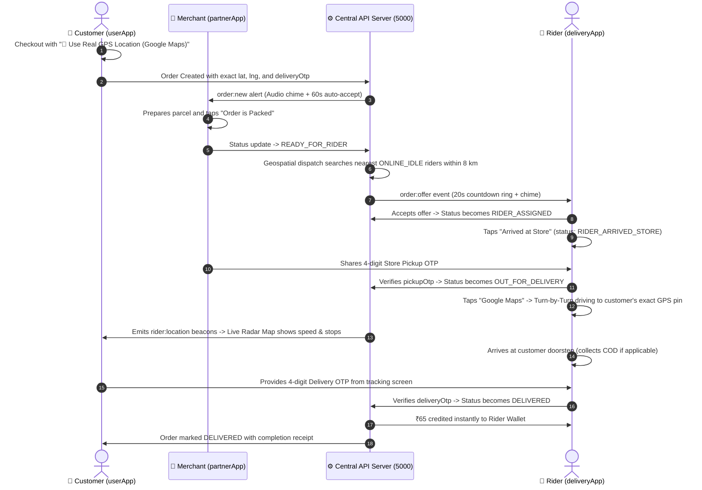

# 🛵 S-farmart 24 — Delivery App (`deliveryApp`)
> **The Real-Time Autonomous Fleet Dispatch & Turn-by-Turn Navigation Engine for Rider Partners**

[](https://reactnative.dev/)
[](https://expo.dev/)
[-blue?style=for-the-badge)](http://localhost:8083)
[](https://maps.google.com)
[](https://expo.dev/)
[](https://reactnative.dev/)

---

## 📑 Master Table of Contents
1. [What is the Farmart Delivery App?](#-what-is-the-farmart-delivery-app)
2. [Tri-App Synergy & Order Handoff Architecture](#-tri-app-synergy--order-handoff-architecture)
3. [Cyber Dark Neon HUD Design Philosophy](#-cyber-dark-neon-hud-design-philosophy)
4. [📍 Real GPS Coordinates & Google Maps Turn-by-Turn Navigation](#-real-gps-coordinates--google-maps-turn-by-turn-navigation)
5. [🛰️ Live Radar Telemetry & Motion Status Detection](#-live-radar-telemetry--motion-status-detection)
6. [🔐 Dual-OTP Verification Protocol (Store & Doorstep)](#-dual-otp-verification-protocol-store--doorstep)
7. [Screen-by-Screen Breakdown](#-screen-by-screen-breakdown)
   - [Screen 1: Duty Console & Pool Queue (`DutyScreen.js`)](#1-duty-console--pool-queue-dutyscreenjs)
   - [Screen 2: Incoming Dispatch Modal (`OrderOfferModal.js`)](#2-incoming-dispatch-modal-orderoffermodaljs)
   - [Screen 3: Active Mission & Navigation (`ActiveNavigationScreen.js`)](#3-active-mission--navigation-activenavigationscreenjs)
   - [Screen 4: Earnings & Milestone Bonus (`EarningsScreen.js`)](#4-earnings--milestone-bonus-earningsscreenjs)
   - [Screen 5: Verified KYC Profile (`ProfileScreen.js`)](#5-verified-kyc-profile-profilescreenjs)
   - [Screen 6: 1-Tap Rider Auth & Session Engine (`RiderLoginScreen.js`)](#6-1-tap-rider-auth--session-engine-riderloginscreenjs)
8. [Dual-Token Auth & Session Persistence Engine](#-dual-token-auth--session-persistence-engine)
9. [Verified Rider Partner Accounts & Credentials](#-verified-rider-partner-accounts--credentials)
10. [Directory Structure](#-directory-structure)
11. [How to Run Locally & Verification Scripts](#-how-to-run-locally--verification-scripts)

---

## 🌾 What is the Farmart Delivery App?

The **Farmart Delivery App (`deliveryApp`)** is a mission-critical mobile and web operating terminal engineered specifically for hyper-local rider partners. Modeled after leading instant-delivery platforms (Blinkit, Zepto, Zomato Fleet), it connects gig delivery riders directly with kitchen partners, Mandi hubs, and everyday households for rapid **20–35 minute door-to-door deliveries**.

```
┌────────────────────────────────────────────────────────────────────────────────────────────────────────┐
│                                   FARMART DELIVERY FLEET TERMINAL                                      │
├───────────────────────────────────┬──────────────────────────────────┬─────────────────────────────────┤
│ 🛵 Dispatch & Routing             │ 🔐 Security & Handshake          │ 💰 Rider Prosperity             │
│ • Geospatial 2dsphere ($near)     │ • 4-digit Store Pickup OTP       │ • ₹65 Instant Credit per Trip   │
│ • 20s Dispatch Audio Countdown    │ • 4-digit Doorstep Delivery OTP  │ • Milestone Incentive Bonuses   │
│ • Direct Google Maps Navigation   │ • COD Cash Enforcement Alert     │ • Wednesday Automated Payouts   │
│ • Exact Customer Lat/Lng Pin      │ • Zero-Loss Parcel Accountability│ • Itemized Delivery Audit Trail │
└───────────────────────────────────┴──────────────────────────────────┴─────────────────────────────────┘
```

---

## 🔄 Tri-App Synergy & Order Handoff Architecture

The delivery partner operates as the physical bridge connecting the digital actions of both Customer and Merchant:



---

## 🎨 Cyber Dark Neon HUD Design Philosophy

Designed specifically for intense outdoor sunlight, vibrations on bike handlebar mounts, and single-handed glove operation:

1. **AMOLED Cyber Slate Surface:** Deep blacks and slate blues (`#0b132b`, `#1c2541`, `#0f172a`) that preserve battery life during long shifts and reduce screen reflection outdoors.
2. **High-Contrast Neon Status Indicators:**
   - 🟢 Active Duty / In Stock: `#10b981` (Neon Emerald)
   - 🔵 Navigation / Actions: `#0284c7` (Electric Sky Cyan)
   - 🟠 Urgent Alert / Prep: `#f59e0b` (Amber Gold)
   - 🔴 Critical / Cash Alert: `#ef4444` (Crimson Warning)
3. **Handlebar-Friendly Touch Targets:** All action buttons have a minimum height of `48px` to `54px`, preventing mis-taps while wearing riding gear.
4. **Dual Sensory Alerts:** Looping Web Audio synthesizers produce high-frequency audible tones paired with mobile vibration bursts for new trip offers.

---

## 📍 Real GPS Coordinates & Google Maps Turn-by-Turn Navigation

Hyperlocal deliveries fail when delivery partners get lost looking for imprecise addresses. Farmart solves this with **end-to-end GPS coordinate synchronization**:

```
[Customer Checkout] ──▶ Real Device GPS (lat, lng) ──▶ Persisted in order.address
                                                                │
                                                                ▼
[Rider Terminal]   ◀── 1-Tap Google Maps Navigation ◀── Coordinates Passed to Rider
```

### How It Works:
1. **Customer GPS Selection:** In `userApp/src/screens/Customer/CheckoutScreen.js`, the customer taps **"📍 Use Real GPS Location (Google Maps)"**. The browser/device retrieves precise latitude & longitude (e.g. `30.9010° N, 75.8573° E`).
2. **Server-Side Persistence:** `server/controllers/orderController.js` saves `address.lat` and `address.lng` directly inside the MongoDB order document.
3. **Rider Terminal Badge:** In `ActiveNavigationScreen.js`, the customer card features a high-visibility verified GPS badge:
   ```text
   📍 GPS: 30.9010° N, 75.8573° E (Exact Google Maps Pin)
   ```
4. **1-Tap Direct Driving Link:** Tapping the **"Google Maps"** button automatically opens turn-by-turn driving navigation directly to the customer's coordinates:
   ```
   https://www.google.com/maps/dir/?api=1&destination=30.9010,75.8573
   ```
   *No manual address typing, no calling the customer for landmarks, zero lost time.*

---

## 🛰️ Live Radar Telemetry & Motion Status Detection

During active transit, the rider partner emits real-time coordinate beacons that empower customer visibility in [`userApp/src/components/LiveOrderMap.js`](../userApp/src/components/LiveOrderMap.js):

1. **High-Frequency Coordinate Beacons:** The rider app transmits location telemetry (`order:rider_location` via WebSocket & `POST /api/rider/location`) containing `{ lat, lng, speed, heading }`.
2. **Intelligent Motion & Stop Detection:**
   - **🟢 Rider is Moving (Speed > 2 km/h):** The map banner shows: *"Rider is Moving (24 km/h)"* with animated radar ripple circles.
   - **🟡 Rider Stopped (Speed ≤ 2 km/h):** When waiting at a red light or intersection, the map immediately clarifies: *"Rider Stopped (0 km/h) • At Traffic Signal / Junction"*.
   - **🏪 Rider at Kitchen:** When arrived at merchant: *"Rider Stopped at Kitchen Counter"*.
3. **Dynamic Haversine Calculation:** Live remaining distance is calculated mathematically in real time, projecting dynamic ETA in minutes.
4. **Google Maps Driving Route Overlay:** Customers can tap **"Open in Google Maps"** to visualize the live driving route directly between the rider and their doorstep.

---

## 🔐 Dual-OTP Verification Protocol (Store & Doorstep)

To guarantee that parcels are never handed to the wrong rider or falsely claimed as delivered, Farmart enforces an industry-first **Two-Tier Dual-OTP Verification Protocol**:

```
┌─────────────────────────────────────────────────────────────────────────────────────────────────┐
│                                 DUAL-OTP SECURITY PROTOCOL                                      │
├────────────────────────────────────────┬────────────────────────────────────────────────────────┤
│ 1️⃣ STORE PICKUP OTP (Pickup Handshake) │ 2️⃣ CUSTOMER DELIVERY OTP (Doorstep Handshake)          │
│ • Generated when order is placed       │ • Generated when order is placed                       │
│ • Displayed on Merchant Console        │ • Displayed on Customer Order Tracking Screen          │
│ • Rider enters OTP in deliveryApp      │ • Rider enters OTP in deliveryApp at customer doorstep │
│ • Validates: READY ➔ OUT_FOR_DELIVERY  │ • Validates: OUT_FOR_DELIVERY ➔ DELIVERED              │
│ • Eliminates wrong parcel pickup       │ • Guarantees genuine doorstep delivery & COD collection│
└────────────────────────────────────────┴────────────────────────────────────────────────────────┘
```

### 💵 COD (Cash On Delivery) Enforcement:
* If the order is COD, the rider terminal flashes a high-visibility crimson card:
  ```text
  ┌──────────────────────────────────────────────┐
  │ 💵 CASH ON DELIVERY: COLLECT ₹247.00        │
  │ Please collect exact cash before OTP verify. │
  └──────────────────────────────────────────────┘
  ```
* For prepaid orders (Razorpay / UPI / Wallet), the screen displays:
  ```text
  ┌──────────────────────────────────────────────┐
  │ 💳 PREPAID ONLINE — ZERO CASH COLLECTION     │
  └──────────────────────────────────────────────┘
  ```

---

## 🔍 Screen-by-Screen Breakdown

```
deliveryApp/src/screens/
├── DutyScreen.js              # Duty toggle (Online/Offline), earnings preview, pool order queue
├── ActiveNavigationScreen.js  # 3-step active trip stepper, Google Maps nav, dual-OTP inputs
├── EarningsScreen.js          # Live earnings ledger, milestone bonuses (+₹150), weekly payout
├── ProfileScreen.js           # Verified KYC credentials, vehicle details, bank account
└── RiderLoginScreen.js        # AMOLED HUD login with 1-tap demo rider switcher
```

---

### 1. Duty Console & Pool Queue (`DutyScreen.js`)
* **Online / Offline Duty Switch:** 1-tap toggle shifting rider state between `ONLINE_IDLE` and `OFFLINE`.
* **Quick Stats Strip:** Today's completed deliveries and accumulated earnings.
* **In-Pool Order Pickup Cards:** Displays available orders in the rider's immediate zone awaiting assignment with 1-tap **"Accept Delivery"** button.

### 2. Incoming Dispatch Modal (`OrderOfferModal.js`)
* **20-Second Countdown Dial:** Animated countdown timer ticking down before the offer is passed to the next candidate.
* **Trip Economics:** Clear display of store pickup location, customer drop area, distance in km, and trip payout (₹65).
* **Audio-Tactile Chime:** Synthesizes urgent G5 + C6 alert chime paired with rhythmic mobile vibration.

### 3. Active Mission & Navigation (`ActiveNavigationScreen.js`)
* **3-Step Mission Stepper:**
  1. **Phase 1: Go to Store** — Displays merchant store address, contact phone dialer, and **"I Have Arrived at Store"** button (`status: 'RIDER_ARRIVED_STORE'`).
  2. **Phase 2: Collect Parcel** — 4-digit Store Pickup OTP input field to verify parcel handover with the partner merchant (`status: 'OUT_FOR_DELIVERY'`).
  3. **Phase 3: Doorstep Delivery** — Customer destination card featuring exact GPS coordinates badge, 1-tap **"Google Maps"** turn-by-turn navigation button, COD cash collection notice, and 4-digit Customer Delivery OTP verification (`status: 'DELIVERED'`).

### 4. Earnings & Milestone Bonus (`EarningsScreen.js`)
* **Live Earnings Cards:** Real-time tally of today's earnings (`todayEarningsPaise`) and total historical payouts.
* **Daily Milestone Tracker:** Progress bar incentivizing high-volume shifts (e.g., *Complete 10 trips today for a +₹150 cash bonus*).
* **Disbursement Schedule:** Direct weekly automated Wednesday 10:00 AM bank transfers.

### 5. Verified KYC Profile (`ProfileScreen.js`)
* **Rider Identity:** Verified photo badge, full name, phone number, and KYC status (`VERIFIED_RIDER`).
* **Vehicle Specs:** Vehicle type (Bike / Scooter / E-Cycle), model, and state registration plate (e.g. `Hero Splendor • PB-10-AB-1234`).
* **Banking Details:** Linked bank account for direct Wednesday disbursements.

### 6. 1-Tap Rider Auth & Session Engine (`RiderLoginScreen.js`)
* **AMOLED HUD Login Form:** Phone number and password inputs with input glow highlights.
* **⚡ 1-Tap Demo Switcher:** 3 pre-configured rider partner accounts for instant 1-tap authentication without manual typing.

---

## 🛡️ Dual-Token Auth & Session Persistence Engine

* **Short-Lived Access Token (15 Minutes):** Cryptographically signed JWT containing `{ id, phone, role: 'rider' }`.
* **Rotating Long-Lived Refresh Token (30 Days):** Cryptographically secure SHA-256 hash stored in MongoDB `refreshtokens` collection with TTL expiration.
* **Single-Flight Axios Auto-Refresh Queue (`src/services/api.js`):** Intercepts HTTP 401s and transparently refreshes credentials without interrupting navigation or trip operations.
* **Persistent Disk Storage (`src/services/storage.js`):** Session survives app minimization, phone reboots, and browser reloads via `AsyncStorage` / `localStorage`.

---

## 🔑 Verified Rider Partner Accounts & Credentials

The following verified rider accounts are pre-seeded in the database for instant testing:

| Rider Name | Phone Number | Password | Vehicle Type | Plate Number | Status |
| :--- | :--- | :--- | :--- | :--- | :--- |
| **Gurmukh Singh** | `9876543220` | `demo123` | 🏍️ Hero Splendor | `PB-10-AB-1234` | Verified Active |
| **Harpreet Singh** | `9876543221` | `demo123` | 🛵 Honda Activa | `PB-10-CD-5678` | Verified Active |
| **Manjinder Singh** | `9876543222` | `demo123` | 🚲 E-Cycle Express | `PB-10-EF-9012` | Verified Active |

*All accounts share the default password: `demo123`.*

---

## 📂 Directory Structure

```text
deliveryApp/
├── assets/                        # Launcher icon, splash screen, and audio assets
├── src/
│   ├── components/
│   │   └── OrderOfferModal.js     # 20s countdown ring with audio chime & accept/decline
│   ├── config/
│   │   └── env.js                 # API base URL & WebSocket server configuration
│   ├── context/
│   │   ├── DeliveryContext.js     # Active mission state, GPS location beacon, socket listeners
│   │   └── RiderAuthContext.js    # Dual-token auth session, duty status switcher, storage
│   ├── navigation/
│   │   └── DeliveryNavigator.js   # Auth gate + 4 bottom tabs (Duty, Active Trip, Earnings, Profile)
│   ├── screens/
│   │   ├── ActiveNavigationScreen.js # 3-step active trip, Google Maps deep-link, dual-OTP inputs
│   │   ├── DutyScreen.js          # Live duty toggle, pay summary, in-pool order pickup
│   │   ├── EarningsScreen.js      # Today's earnings, weekly milestone progress, trip ledger
│   │   ├── ProfileScreen.js       # Verified KYC credentials, vehicle details, bank info
│   │   └── RiderLoginScreen.js    # AMOLED HUD login with 1-tap demo rider switcher
│   ├── services/
│   │   ├── api.js                 # Axios instance with single-flight token refresh mutex
│   │   ├── socket.js              # Resilient Socket.IO connection manager
│   │   └── storage.js             # AsyncStorage + LocalStorage fallback
│   └── theme/
│       └── colors.js              # Cyber dark neon palette tokens
├── App.js                         # Root entry with RiderAuthProvider & DeliveryProvider
├── app.json                       # Expo configuration (Port 8083)
├── package.json                   # Dependencies & build scripts
└── README.md                      # Documentation (this file)
```

---

## 💻 How to Run Locally & Verification Scripts

### 1. Run Rider App on Web (Port 8083)
```bash
cd deliveryApp
npx expo start --web --port 8083
```
*Open in browser:* [http://localhost:8083](http://localhost:8083)

### 2. Tri-App Ecosystem Overview
* 🛒 **Customer App (`userApp`)**: [http://localhost:8081](http://localhost:8081)
* 🏪 **Partner App (`partnerApp`)**: [http://localhost:8082](http://localhost:8082)
* 🛵 **Rider App (`deliveryApp`)**: [http://localhost:8083](http://localhost:8083)
* ⚙️ **Backend API Server**: [http://localhost:5000](http://localhost:5000)

### 3. Run Automated Multi-Actor Delivery Cycle
To test the complete end-to-end flow (User Checkout with real GPS ➔ Merchant Kitchen Prep ➔ Rider Dispatch & Accept ➔ Store Pickup OTP ➔ Turn-by-Turn Nav ➔ Doorstep Delivery OTP):

```bash
# In root workspace:
node server/scripts/executeFullDeliveryCycle.js
```

### 4. Run Delivery Assignment Verification
```bash
node server/utils/testDeliveryFlow.js
```

### 5. Run Full Master Acceptance Suite (27/27 Tests)
```bash
npm test
```

---

© 2026 **Farmart**. All rights reserved.  
*Empowering Rural Farmers • Celebrating Home Chefs • Fast Autonomous Doorstep Deliveries.*
