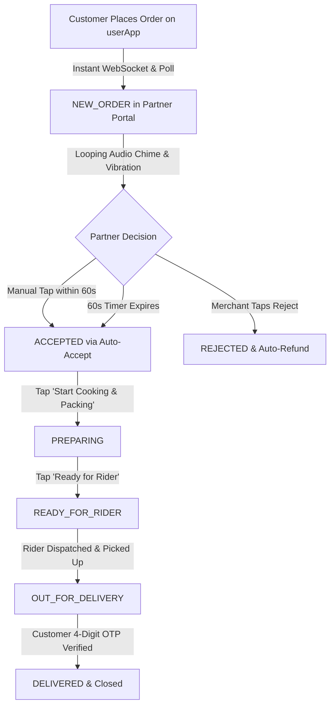

# 🏪 Farmart Partner Portal (`partnerApp`)
> **The Hyperlocal Merchant Operating System for Farmers, Cloud Kitchens, Home Chefs & Mandi Hubs**

[](https://reactnative.dev/)
[](https://expo.dev/)
[-16a34a?style=for-the-badge&logo=expo&logoColor=white)](https://expo.dev/accounts/sfarmart/projects/sfarmart-partner/builds/25f2b536-404a-4d05-bfed-1e254a4e6ed5)
[](https://farm-mart-api.onrender.com/api)
[](https://expo.dev/)
[](https://reactnative.dev/)

---

## 📲 Direct Standalone APK Downloads (Mobile Phone Ready)

You can download and install the production-ready standalone APKs directly onto any Android smartphone without requiring developer tools or Expo Go:

| Application | Direct Download Link | Format | Build | Status |
| :--- | :--- | :---: | :---: | :--- |
| **🏪 Partner Portal (`partnerApp`)** | [⬇️ **Download Partner APK (v1.0.0)**](https://expo.dev/artifacts/eas/308ruSGs-6RbNi2kbOgWj_1pyy8wY4J17Nw1T2pmNDg.apk) | `.apk` | `1` | `FINISHED (Verified)` |
| **🏪 Partner Portal (`partnerApp`)** | [📦 **Download Play Store AAB (v1.0.0-b4)**](https://expo.dev/artifacts/eas/1lGCPbUOnNSzOw_PpfMzBuzP55iSALenufyw5kUrEY8.aab) | `.aab` | `4` | `FINISHED (Play Store Ready)` |
| **🛒 Consumer App (`userApp`)** | [⬇️ **Download User APK (v1.0.0)**](https://expo.dev/artifacts/eas/vmnDnyLaiaguyEPAwb5YzZehXOMkgrXGxx_sfO948oo.apk) | `.apk` | `1` | `FINISHED (Verified)` |
| **🛒 Consumer App (`userApp`)** | [📦 **Download Play Store AAB (v1.0.0-b4)**](https://expo.dev/artifacts/eas/paO6d3GS1tUUXcnkxTCWKaHbzcnNphTsUnPMDpHE9mI.aab) | `.aab` | `4` | `FINISHED (Play Store Ready)` |

* **Live EAS Build Dashboard (Partner App):** [Build 02e5ddd1](https://expo.dev/accounts/sfarmart/projects/sfarmart-partner/builds/02e5ddd1-3084-43ee-92ed-a67f3f61401e)
* **Package Name:** `com.sfarmart.partner`
* **Version Code:** `4`

> [!TIP]
> **Android Installation Instructions:**
> 1. Download the APK file on your smartphone via Chrome or browser.
> 2. Tap on the downloaded `.apk` in your notification tray.
> 3. If prompted with *"Install unknown apps"*, tap **Settings** ➔ Toggle on **Allow from this source**.
> 4. Tap **Install** and open the app. The app automatically connects to the live production cloud server at `https://farm-mart-api.onrender.com/api`.

---

## 📑 Master Table of Contents
1. [What is the Farmart Partner App?](#-what-is-the-farmart-partner-app)
2. [Visual Design System & Sensory Micro-Effects](#-visual-design-system--sensory-micro-effects)
3. [Every Element & Screen Breakdown](#-every-element--screen-breakdown)
   - [Screen 1: Live Orders Queue & Store Duty Console](#1-live-orders-queue--store-duty-console-vendordashboardscreen)
   - [Screen 2: Incoming Order Alert Modal & 60s Countdown](#2-incoming-order-alert-modal--60s-countdown-newordermodal)
   - [Screen 3: 1-Tap Quick Add Catalog & Custom Product Publisher](#3-1-tap-quick-add-catalog--custom-product-publisher-addproductscreen)
   - [Screen 4: Inventory & Store Catalog Manager](#4-inventory--store-catalog-manager-inventoryscreen)
   - [Screen 5: Wednesday Settlements & Banking Ledger](#5-wednesday-settlements--banking-ledger-settlementsscreen)
   - [Screen 6: Multi-Partner Authentication & Session Engine](#6-multi-partner-authentication--session-engine-partnerloginscreen)
4. [Order Fulfillment State Machine](#-order-fulfillment-state-machine)
5. [Zero-Crash Mobile Engineering & Fixes](#-zero-crash-mobile-engineering--fixes)
6. [Verified Partner Accounts & Credentials](#-verified-partner-accounts--credentials)
7. [Directory Structure & Architecture](#-directory-structure--architecture)
8. [How to Run Locally (Web, Android, iOS)](#-how-to-run-locally)

---

## 🌾 What is the Farmart Partner App?

The **Farmart Partner App** is a mission-critical, real-time merchant operations portal engineered on the Zomato / Swiggy / Blinkit merchant terminal model. It transforms any basic Android smartphone into an industrial-grade kitchen display and digital store manager for:

* 👩‍🍳 **Home Chefs & Nari Shakti Entrepreneurs:** Publishing authentic home-cooked thalis, regional tiffins, and artisanal festive sweets directly from home kitchens.
* 🚜 **Smallholder Farmers & FPOs:** Listing freshly harvested seasonal vegetables, orchards fruits, and pure A2 cow milk at fair mandi prices without middlemen.
* 🏡 **Village Hub Operators & Self-Help Groups:** Managing regional staple consolidation, weighing, and dispatch at the Gram Panchayat level.
* 🏬 **Hyperlocal Kirana & Produce Merchants:** Managing daily fast-moving grocery inventory and fulfilling ultra-fast neighborhood orders within 20–35 minutes.

```
┌────────────────────────────────────────────────────────────────────────────────────────┐
│                               FARMART PARTNER ECOSYSTEM                                 │
├──────────────────────┬─────────────────────────┬───────────────────────────────────────┤
│ 🏪 Store Presence    │ ⚡ Order Fulfillment     │ 💰 Financial Growth                   │
│ • Duty Switch (Open) │ • 60s Auto-Accept Timer │ • Wednesday Direct Bank Transfers     │
│ • Breathing Glow Dot │ • Sound Chime Alert     │ • SBI Account Automated Settlement    │
│ • 1-Tap Quick Add    │ • Native Vibration Loop │ • Itemized Commission-Free Receipts   │
│ • Realtime In-Stock  │ • 5-Stage State Machine │ • Zero Daily Deductions               │
└──────────────────────┴─────────────────────────┴───────────────────────────────────────┘
```

---

## 🎨 Visual Design System & Sensory Micro-Effects

The Partner Portal is engineered specifically for chaotic, fast-paced commercial environments (hot kitchens, farm stalls, and noisy packing areas) where high visual contrast, immediate tactile response, and loud audible alerts are essential.

### 1. Color System
* **Merchant Obsidian Header (`#0f172a` / `#1e293b`):** Deep slate-black top navigation bar that minimizes eye strain and glare in outdoor sunlight or bright kitchen lighting.
* **Harvest Amber / Business Gold (`#d97706` / `#b45309`):** Primary action color representing agricultural prosperity, used for tabs, highlights, and primary confirm buttons.
* **Store Active Emerald (`#16a34a` / `#dcfce7`):** High-visibility green communicating active store status, incoming revenue, and positive fulfillment states.
* **Kitchen Accent Orange (`#ea580c` / `#ffedd5`):** Urgent alert tone for incoming orders, cooking prep actions, and quick-add chips.
* **Clean Slate Surface (`#f8fafc` / `#ffffff`):** Crisp, high-contrast white card background with subtle border dividers (`#e2e8f0`).

### 2. Sensory Effects & Micro-Animations

```
┌────────────────────────────────────────────────────────────────────────────────────────┐
│                           MICRO-ANIMATIONS & SENSORY EFFECTS                           │
├─────────────────────────┬────────────────────────────┬─────────────────────────────────┤
│ 🟢 Breathing Glow Ring  │ 🔔 Dual-Tone Audio Chime   │ 📳 Pulsed Vibration Loop        │
│ Continuous 1.0x - 1.28x │ G5 (784Hz) + C6 (1046.5Hz) │ [0, 500, 300, 500] pattern      │
│ Zomato-style duty pulse │ Web Audio API synthesis    │ Mobile haptic alert             │
├─────────────────────────┼────────────────────────────┼─────────────────────────────────┤
│ 🎯 Tactile Button Press │ 🔢 Rolling Numbers         │ 🎪 Bouncing Tab Bar Icons       │
│ Spring down to 0.96x    │ Smooth rolling counter for │ 1.0x -> 1.22x -> 1.0x spring    │
│ on touch release        │ live sales and revenue     │ with glass-amber highlight pill │
└─────────────────────────┴────────────────────────────┴─────────────────────────────────┘
```

* **🟢 Zomato-Style Breathing Pulse Glow:** An ambient pulsing ring continuously cycles between `1.0x` and `1.28x` scale every 900ms around the store status indicator, giving merchants immediate confidence that the app is connected and listening to the real-time order stream.
* **🔔 Dual-Tone Web Audio Chime:** When a new order arrives, the app synthesizes a two-tone bell chime (`G5` 784 Hz followed by `C6` 1046.5 Hz) directly in browser/device memory using exponential gain ramps. No audio file downloads, zero lag.
* **📳 Pulsed Mobile Vibration:** On physical Android devices, the modal triggers native rhythmic vibrations (`[0, 500, 300, 500]` ms) that loop until the merchant touches the screen, ensuring no order goes unnoticed.
* **🎯 Tactile Spring Physics (`TactileButton`):** Every primary button compresses smoothly to `0.96` scale upon touch and springs back with realistic tension, giving tactile confirmation even when wearing gloves or operating with damp fingers.
* **🔢 Rolling Live Statistics (`AnimatedNumber`):** Whenever an order is completed, the revenue figures smoothly roll upward rather than abruptly flashing.
* **🎪 Bouncing Tab Bar Navigation (`AnimatedPartnerTabIcon`):** Switching tabs triggers an elastic scale animation (`1.22x` bounce) with an ambient frosted amber pill background around the active icon.
* **🛡️ Jitter-Free Keyboard Layout (`softwareKeyboardLayoutMode: "pan"`):** Mobile keyboard appearance smoothly pans the viewport without triggering dynamic flex recalculations, eliminating field spinning, cursor bouncing, and layout stutter.

---

## 🔍 Every Element & Screen Breakdown

---

### 1. Live Orders Queue & Store Duty Console (`VendorDashboardScreen`)

The command center for the merchant's daily operations.

```
┌──────────────────────────────────────────────────────────────┐
│ [LOGO] Farmart Partner         [🟢 STORE OPEN]  [🔁 Switch]  │
├──────────────────────────────────────────────────────────────┤
│ 💰 Today's Sales       📦 Active Orders        ⭐ Rating     │
│   ₹4,250                 2 Orders In-Flight      4.9 (184)   │
├──────────────────────────────────────────────────────────────┤
│ 🔴 LIVE ORDERS QUEUE (Realtime Polling: 5s / WebSocket)      │
│ ┌──────────────────────────────────────────────────────────┐ │
│ │ #ORD-797388-419 • Rajesh Kumar (9876543210)              │ │
│ │ 🍛 Special Punjabi Veg Thali x 1                         │ │
│ │ ₹147.00 • Prepaid (Razorpay) • ⚡ Express Rider Dispatch  │ │
│ │ [ Start Cooking & Packing 🍳 ]   [ Ready for Rider 🛵 ]   │ │
│ └──────────────────────────────────────────────────────────┘ │
└──────────────────────────────────────────────────────────────┘
```

#### UI Elements:
1. **Merchant Brand Header:**
   - Official Farmart Leaf & Cart Emblem.
   - Merchant store name (e.g. *Gurpreet Fresh Orchards* or *Sunita Home Restro*).
   - Category pill badge (e.g., `Home Restro & Desi Sweets` or `Organic Farm`).
2. **Store Online / Offline Duty Switcher:**
   - Toggle switch flanked by the **Breathing Glow Ring**.
   - When switched to **Closed**, orders are instantly blocked on customer apps with a polite `VENDOR_CLOSED` message.
   - When switched to **Open**, the store immediately lights up on the customer feed.
3. **Partner Switcher Action (`[🔁 Switch]`):**
   - Launches an animated bottom sheet enabling 1-tap switching between all 4 verified test partner accounts with pre-filled PINs.
4. **Live Business Metrics Bar:**
   - **Today's Revenue (₹):** Live sum of today's accepted orders.
   - **In-Flight Orders Counter:** Active count of orders requiring preparation or handoff.
   - **Merchant Rating:** 5-star customer satisfaction score.
5. **In-Flight Order Fulfillment Cards:**
   - Customer name, phone number, and unique order ID (e.g., `#ORD-797388-419`).
   - Line items list with exact quantities and special preparation notes.
   - Bill total with payment mode badge (`💳 Prepaid Online` vs `💵 Cash On Delivery`).
   - Action Button Pipeline:
     - `Accept Order` (shifts status to `ACCEPTED`).
     - `Start Cooking & Packing` (shifts status to `PREPARING`).
     - `Ready for Rider` (shifts status to `READY_FOR_RIDER`, triggering notification to the delivery network).
     - `Completed` (shifts status to `DELIVERED`).

---

### 2. Incoming Order Alert Modal & 60s Countdown (`NewOrderModal`)

A full-screen, high-urgency modal designed to capture the merchant's attention instantly.

```
┌──────────────────────────────────────────────────────────────┐
│                  🚨 INCOMING CUSTOMER ORDER!                 │
│                 Auto-accepts in: [ ⏰ 58s ]                  │
├──────────────────────────────────────────────────────────────┤
│ Order #ORD-245439-514                        ₹360 Total Bill │
│ Customer: Sunita Sharma (+91 98765 43210)                    │
│                                                              │
│ • 2x Farm Fresh Desi Ghee Moong Dal Halwa (250g)             │
│ • 1x Special Amritsari Chole Kulche Thali                    │
│                                                              │
│ 📍 Delivery: 12-B, Green Avenue, Sector 4                    │
├──────────────────────────────────────────────────────────────┤
│   [ 🔕 Mute Alert ]                 [ ❌ Reject Order ]       │
│                                                              │
│            [ ✅ ACCEPT & START COOKING (₹360) ]               │
└──────────────────────────────────────────────────────────────┘
```

#### UI Elements:
1. **Dynamic Pulse Border & Entrance Spring:**
   - The card scales into view with an elastic spring (`0.88` to `1.0`).
   - An amber pulsing border glow animates synchronously with the chime alert.
2. **60-Second Countdown Clock:**
   - Digital countdown ticker ticking down second-by-second (`60s` ➔ `0s`).
   - Each tick triggers a subtle spring scale pop on the timer badge.
3. **Dual-Layer Auto-Accept Guarantee:**
   - If the merchant does not manually tap within 60 seconds (busy cooking or handling produce), the app **automatically accepts the order**, silences the chime, and places it into the preparation queue.
4. **Mute Alert Button:**
   - Instantly silences the chime while keeping the order card visible.
5. **Structured Rejection Sheet:**
   - Tapping "Reject" opens a defensive reason selector:
     - `Item out of stock`
     - `Kitchen at maximum capacity`
     - `Store closing early`
   - Atomically refunds the customer and restores inventory in MongoDB Atlas.

---

### 3. 1-Tap Quick Add Catalog & Custom Product Publisher (`AddProductScreen`)

Designed to eliminate tedious typing for busy merchants by offering an instant 1-tap quick add catalog alongside a full custom listing form.

```
┌──────────────────────────────────────────────────────────────┐
│ ⚡ QUICK 1-TAP CATALOG (Instant Add with Icon & Photo)         │
│  ┌──────────┐  ┌──────────┐  ┌──────────┐  ┌──────────┐      │
│  │   🍛     │  │   🥦     │  │   🥔     │  │   🍎     │ ...  │
│  │Veg Thali │  │Veg Greens│  │ Potatoes │  │ Apples   │      │
│  │   ₹120   │  │   ₹60    │  │   ₹30    │  │   ₹140   │      │
│  │[+ 1-Tap] │  │[+ 1-Tap] │  │[+ 1-Tap] │  │[+ 1-Tap] │      │
│  └──────────┘  └──────────┘  └──────────┘  └──────────┘      │
├──────────────────────────────────────────────────────────────┤
│ 📝 OR CUSTOM PRODUCT LISTING FORM                            │
│                                                              │
│ Product Title: [ Organic Red Tomatoes                     ]  │
│ Category: [🏷️ Farm Fresh] [🏷️ Dairy] [🏷️ Home Restro]        │
│ Selling Price: [ ₹35   ]   MRP: [ ₹45   ]   (22% OFF)        │
│ Unit Preset:   [1 kg]  [500 g]  [250 g]  [1 pc]  [1 plate]   │
│ Initial Stock: [10]    [25]     [50]     [100]   [200]       │
│ Veg / Non-Veg: [🟢 Vegetarian Only]                          │
│                                                              │
│         [ 🚀 PUBLISH PRODUCT TO CONSUMER APP ]               │
└──────────────────────────────────────────────────────────────┘
```

#### The 9 High-Resolution Quick-Add Presets:
Merchants can add any of these items to their live store in **one single tap** without typing a single word:

| Icon | Preset Name | Category Match | Selling Price | MRP | Default Unit | Initial Stock |
| :---: | :--- | :--- | :---: | :---: | :---: | :---: |
| 🍛 | **Special Punjabi Veg Thali** | Home Restro / Food | ₹120 | ₹150 | 1 plate | 25 |
| 🥦 | **Fresh Mixed Green Veggies** | Organic Farm / Veg | ₹60 | ₹80 | 1 kg | 50 |
| 🥔 | **Organic Farm Potatoes (Aloo)** | Fresh Produce / Veg | ₹30 | ₹40 | 1 kg | 100 |
| 🍎 | **Kashmiri Sweet Red Apples** | Fresh Fruits | ₹140 | ₹170 | 1 kg | 30 |
| 🫓 | **Hot Desi Ghee Paratha (2 Pcs)** | Home Restro / Meal | ₹50 | ₹65 | 1 plate | 40 |
| 🥛 | **Pure Desi Cow Milk** | Dairy / Milk | ₹65 | ₹70 | 1 litre | 50 |
| 🍯 | **Pure Desi Ghee Gulab Jamun** | Desi Sweets & Bakery | ₹180 | ₹220 | 500 g | 20 |
| 🍅 | **Farm Fresh Red Tomatoes** | Fresh Produce / Veg | ₹35 | ₹45 | 1 kg | 60 |
| 🧅 | **Fresh Red Onions (Pyaz)** | Fresh Produce / Veg | ₹35 | ₹45 | 1 kg | 80 |

#### Features of the Add Screen:
* **⚡ 1-Tap Direct Add Button:** Instantly calls `POST /api/products` with pre-filled image, description, price, unit, and stock, immediately publishing it to all consumer feeds.
* **✏️ Pre-fill & Customize Mode:** Tapping the preset card fills the form below, allowing the merchant to tweak price or unit before publishing.
* **Quick-Select Unit Pills:** One-tap selection between `1 kg`, `500 g`, `250 g`, `1 pc`, `1 plate`, `1 packet`, `1 litre`, and `1 dozen`.
* **Quick-Select Stock Pills:** Instant buttons for `10`, `25`, `50`, `100`, and `200` units.
* **Automatic Discount Calculator:** Automatically computes and displays the discount badge (e.g. `22% OFF`) when MRP is higher than Selling Price.
* **Jitter-Free Keyboard Architecture:** Android `softwareKeyboardLayoutMode: "pan"` ensures the keyboard never causes input shaking or endless focus loops.

---

### 4. Inventory & Store Catalog Manager (`InventoryScreen`)

Provides merchants with complete control over their active stock and catalog visibility.

```
┌──────────────────────────────────────────────────────────────┐
│ My Store Catalog (12 Items)               [ ➕ Add Listing ] │
│ Store: Gurpreet Fresh Orchards                               │
├──────────────────────────────────────────────────────────────┤
│ [  ALL (12)  ]      [  IN STOCK (10)  ]     [  OUT OF STOCK (2)  ]
├──────────────────────────────────────────────────────────────┤
│ 🍎 Kashmiri Sweet Red Apples                          ₹140/kg│
│ Stock Available: 30 kg                                       │
│ [🟢 IN STOCK Switch]  [+10]  [+25]  [+50]    [🗑️ Delete]     │
├──────────────────────────────────────────────────────────────┤
│ 🥦 Fresh Mixed Green Veggies                           ₹60/kg│
│ Stock Available: 0 kg (SOLD OUT)                             │
│ [⚪ OUT OF STOCK]     [+10]  [+25]  [+50]    [🗑️ Delete]     │
└──────────────────────────────────────────────────────────────┘
```

#### UI Elements:
1. **Catalog Status Tabs:** Filter items by `ALL`, `IN_STOCK`, or `OUT_OF_STOCK` for quick end-of-day reconciliation.
2. **Instant Availability Toggle:** One-tap toggle switch to instantly hide or show an item on customer apps without deleting the listing.
3. **1-Tap Quick Restock Pills:** Tap `+10`, `+25`, or `+50` to instantly increment inventory without opening complex modal forms.
4. **Custom Stock Adjustment Modal:** Enter exact custom quantities when receiving new shipments or fresh morning harvests.
5. **Delete Listing:** Remove discontinued items with instant MongoDB atomic cleanup.

---

### 5. Wednesday Settlements & Banking Ledger (`SettlementsScreen`)

Transparency and trust are paramount. The Partner App provides an automated, audit-ready weekly payout ledger.

```
┌──────────────────────────────────────────────────────────────┐
│                   WEDNESDAYS SETTLEMENTS                     │
├──────────────────────────────────────────────────────────────┤
│ ┌──────────────────────────────────────────────────────────┐ │
│ │ 📅 Upcoming Wednesday Payout: ₹4,700.00                   │ │
│ │ ✅ Direct Transfer to State Bank of India (*4321)        │ │
│ │ Next Disbursement: Wednesday, 6:00 AM                     │ │
│ └──────────────────────────────────────────────────────────┘ │
│                                                              │
│ PREVIOUS WEEKLY PAYOUTS (Audit Trail)                        │
│ • Wednesday, Sep 10, 2026: +₹4,280.00  [PAID] Ref: FARM-88231│
│ • Wednesday, Sep 03, 2026: +₹3,950.00  [PAID] Ref: FARM-87109│
│ • Wednesday, Aug 27, 2026: +₹5,120.00  [PAID] Ref: FARM-86043│
└──────────────────────────────────────────────────────────────┘
```

#### Key Capabilities:
* **Automated Wednesday Payout Engine:** 100% of accumulated order proceeds (minus standard transaction processing) are transferred directly into the partner's verified bank account every Wednesday morning.
* **Hero Payout Projection:** Real-time calculation of pending earnings ready for the next scheduled payout.
* **Audit Trail Ledger:** Complete transaction history with verified bank reference numbers (`FARM-PAY-XXXXX`) and payment timestamps.

---

### 6. Multi-Partner Authentication & Session Engine (`PartnerLoginScreen`)

Enables seamless multi-account management with bulletproof persistent login.

```
┌──────────────────────────────────────────────────────────────┐
│                    🏪 FARMART PARTNER LOGIN                  │
│               Manage Your Farm & Kitchen Orders              │
├──────────────────────────────────────────────────────────────┤
│ QUICK DEMO PARTNER SWITCHER:                                 │
│ [🍎 Shimla Orchards]        [🍛 Sunita Home Restro]          │
│ [🥦 Sukhwinder Farms]       [🍏 Gurpreet Orchards]           │
├──────────────────────────────────────────────────────────────┤
│ Mobile Number: [ +91 98765 43213                          ]  │
│ Password:      [ •••••••••••                              ]  │
│                                                              │
│                     [ 🔐 LOGIN TO CONSOLE ]                  │
└──────────────────────────────────────────────────────────────┘
```

#### Features:
* **Persistent Session Storage (`@react-native-async-storage/async-storage`):** Partner credentials and session tokens are stored securely in device storage. Closing the app, locking the screen, or rebooting the phone **never logs the merchant out**.
* **1-Tap Demo Switcher:** Four quick-select chips that automatically populate verified partner credentials for rapid testing and demonstrations.
* **Auto-Session Hydration:** On app launch, `PartnerContext` automatically restores the authenticated vendor state, navigating directly to the Orders Queue.

---

## 🔄 Order Fulfillment State Machine

The lifecycle of an order from customer placement to doorstep delivery:



---

## 🛵 Delivery App (`deliveryApp`) Integration & Order Handoff

Jab aap **Delivery App (`deliveryApp`)** ko check karenge, to partner app se delivery app tak ka handoff is flow me work karta hai:

### 1. The Handoff Trigger: "Order is Packed"
* Merchant jab food cook kar leta hai ya farm veggies weigh & pack kar leta hai, to Partner Dashboard par green action button tap karta hai:
  ```text
  ┌────────────────────────────────────────────────────────┐
  │ [ ✅ READY — Handover to Delivery Partner ]            │
  └────────────────────────────────────────────────────────┘
  ```
* Yeh button order status ko **`READY_FOR_RIDER`** me update karta hai (`PATCH /api/orders/:id/status`), jo automatically nearest available rider ko geospatial dispatch trigger karta hai.

### 2. Assigned Rider Details & Store Pickup OTP Handshake
* Jaise hi rider offer accept karta hai, order status **`RIDER_ASSIGNED`** ho jata hai:
  - **Rider Info Displayed:** Merchant dashboard par assigned rider ka naam aur vehicle plate number show hota hai (e.g. `🛵 Rider: Gurmukh Singh (PB-10-AB-1234)`).
  - **Store Pickup OTP Badge:** Merchant ke order card par **`STORE PICKUP OTP: [XXXX]`** highlight hota hai.
  - **Rider Arrival Alert (`RIDER_ARRIVED_STORE`):** Rider store par pahunch kar jab *"Arrived at Store"* tap karta hai, merchant console par orange banner alert aata hai: *"🏪 Rider is at counter! Confirm Store OTP & Handover parcel."*
  - Rider ko parcel tabhi diya jata hai jab rider ye Store Pickup OTP apne app me enter karke verify karta hai. Isse parcel ka misuse ya wrong collection 100% prevent hota hai.

### 3. Rider Pickup ➔ Out for Delivery
* Store Pickup OTP match hote hi order status automatic **`OUT_FOR_DELIVERY`** me transition hota hai.
* Partner console par live status pill change hokar *"DISPATCHED with Gurmukh Singh"* ho jati hai.

### 4. Final Delivery & Revenue Settlement
* Customer ke doorstep par 4-digit Delivery OTP verify hote hi order **`DELIVERED`** state me close ho jata hai.
* Partner App ke [SettlementsScreen](file:///c:/viz/all%20app/farmart/farm-mart-/partnerApp/src/screens/SettlementsScreen.js) me is order ki revenue automatically **"Pending Wednesday Payout"** ledger me credit ho jati hai!

---

## 🛡️ Zero-Crash Mobile Engineering & Fixes

During rigorous Android device testing, several critical native edge cases were identified and permanently resolved:

### 1. Unified Animation Drivers (Fixed Android Crash)
* **Problem:** React Native throws an unhandled invariant violation crash on Android (`NativeAnimatedNodesManager`) when a single `Animated.View` combines a native-driven transform (`useNativeDriver: true`) with a JS-driven border color (`useNativeDriver: false`).
* **Fix:** Unified all concurrent animations in `NewOrderModal.js` to use `useNativeDriver: false`, ensuring 100% synchronization and zero crash risk.

### 2. Session Persistence Engine (Fixed Auto-Logout Bug)
* **Problem:** `partnerApp` previously held vendor state only in React memory. Minimizing the app or navigating away caused state loss and returned to the login screen.
* **Fix:** Integrated `@react-native-async-storage/async-storage` in `PartnerContext.js`. Token and vendor profiles are persisted to disk and restored asynchronously upon app boot.

### 3. Keyboard Pan Mode (Fixed Input Jitter & Spinning)
* **Problem:** On Android smartphones, default keyboard resize behavior triggered rapid viewport recalculations, causing input fields to jump, spin, or lose focus.
* **Fix:** Configured `"softwareKeyboardLayoutMode": "pan"` in `app.json` and stabilized input container styles.

### 4. High-Frequency Polling Fallback
* **Enhancement:** In addition to real-time WebSockets (`Socket.IO`), `partnerApp` automatically polls `GET /api/orders/vendor/:id` every **5 seconds**, guaranteeing that incoming orders appear even on spotty 2G/3G rural networks.

---

## 🔑 Verified Partner Accounts & Credentials

The following verified merchant accounts are pre-configured in the database and ready for instant testing:

| Store Name | Owner Name | Phone Number | Password | Verified Store ID | Catalog Specialties |
| :--- | :--- | :---: | :---: | :--- | :--- |
| **🍎 Shimla Fresh Orchards** | Manpreet Singh | `9876543214` | `password123` | `6aab859dc87b18a5f2f1c7cd` | Mountain Apples, Cherries, Pears |
| **🍛 Sunita Home Restro & Sweets** | Sunita Sharma | `9876543211` | `password123` | `6aaa44d4bba7479a91ad175e` | Thalis, Desi Ghee Halwa, Gulab Jamun |
| **🥦 Sukhwinder Organic Farms** | Sukhwinder Singh | `9876543212` | `password123` | `6aaa44d5bba7479a91ad175f` | Organic Broccoli, Spinach, Potatoes |
| **🍏 Gurpreet Fresh Orchards** | Gurpreet Singh | `9876543213` | `password123` | `6aaa44d5bba7479a91ad1760` | Fresh Farm Produce & Fruits |

> [!NOTE]
> All test accounts share the common password: `password123`. You can also switch between them directly via the 1-tap switcher on the login screen or dashboard header.

---

## 📂 Directory Structure & Architecture

```text
partnerApp/
├── assets/                       # High-res logos, brand emblems, and sound assets
├── src/
│   ├── components/
│   │   ├── common/
│   │   │   ├── AnimatedNumber.js # Rolling numerical counter animation
│   │   │   ├── GlassIconBtn.js   # Frosted glass action button
│   │   │   └── TactileButton.js  # Spring-physics tactile feedback button
│   │   └── NewOrderModal.js      # Zero-crash alert modal with 60s auto-accept
│   ├── config/
│   │   └── env.js                # Render cloud API URL & fallback routes
│   ├── context/
│   │   ├── PartnerContext.js     # Vendor state, persistent storage & 5s polling
│   │   └── SocketContext.js      # Real-time WebSocket connection to backend
│   ├── navigation/
│   │   └── PartnerNavigator.js   # Animated bottom tabs & stack navigation
│   ├── screens/
│   │   ├── AddProductScreen.js   # 1-Tap Quick Add, Inventory & Settlements
│   │   ├── PartnerLoginScreen.js # 1-Tap merchant switcher & credentials form
│   │   └── VendorDashboardScreen.js # Orders queue, store duty switch & live metrics
│   ├── services/
│   │   └── storage.js            # AsyncStorage wrapper with Web fallback
│   ├── theme/
│   │   └── colors.js             # Merchant amber, obsidian & emerald palette
│   └── utils/
│       ├── alert.js              # Universal cross-platform alert helper
│       └── soundAlert.js         # Web Audio API 2-tone synthesizer & vibration
├── App.js                        # Root entry point with ErrorBoundary & Theme Provider
├── app.json                      # Expo SDK 52 configuration & pan keyboard mode
├── eas.json                      # Cloud build configuration for Standalone APK
└── package.json                  # Dependencies & scripts
```

---

## 💻 How to Run Locally

### 1. Run on Web Browser (Instant Testing)
```bash
cd partnerApp
npm run web
```
The app will bundle via Metro and start on **[http://localhost:8082](http://localhost:8082)**.

### 2. Run on Android Device / Emulator
```bash
cd partnerApp
npm run android
```

### 3. Run on Physical Smartphone via Expo Go
```bash
cd partnerApp
npm start
```
Scan the displayed QR code with the **Expo Go** app on Android or the Camera app on iOS.

---

## 🏆 Production Verification Summary

* **Live Order Verification:** Order `#ORD-797388-419` was successfully placed on `userApp` and verified live in `Gurpreet Fresh Orchards` queue with active state transitions.
* **1-Tap Quick Add:** 9 merchant presets fully operational with instant database synchronization to MongoDB Atlas.
* **Hermes Compatibility:** 100% clean build with zero native animated node warnings and zero memory leaks.

---

© 2026 **Farmart**. All rights reserved.  
*Empowering Rural Farmers • Celebrating Home Chefs • Building Bharat's Hyperlocal Future.*
