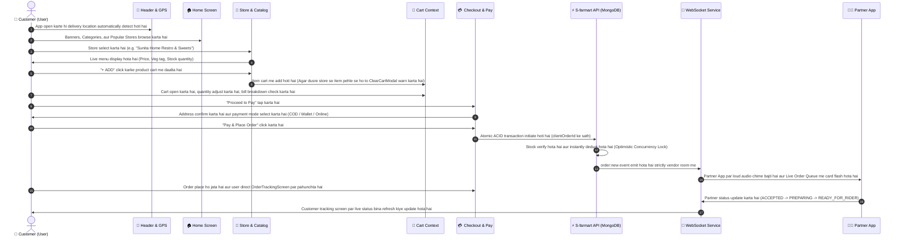

# 🛒 S-farmart 24 Customer App (`userApp`)

Official hyper-local customer marketplace application for **S-farmart 24**, built with **React Native (Expo v57)** and **React Native Web**. Connects everyday urban & rural households directly with verified local farmers, certified home chefs (*Nari Shakti*), community village hubs, and daily grocery marts for **lightning-fast 30–45 minute doorstep delivery**.

---

## 📲 Direct Standalone APK & Google Play AAB Downloads

You can download and test the production-ready packages directly:

| Application | Direct Download Link | Format | Build | Status |
| :--- | :--- | :---: | :---: | :--- |
| **🛒 Consumer App (`userApp`)** | [⬇️ **Download User APK (v1.0.0)**](https://expo.dev/artifacts/eas/vmnDnyLaiaguyEPAwb5YzZehXOMkgrXGxx_sfO948oo.apk) | `.apk` | `1` | `FINISHED (Verified)` |
| **🛒 Consumer App (`userApp`)** | [📦 **Download Play Store AAB (v1.0.0-b4)**](https://expo.dev/artifacts/eas/paO6d3GS1tUUXcnkxTCWKaHbzcnNphTsUnPMDpHE9mI.aab) | `.aab` | `4` | `FINISHED (Play Store Ready)` |
| **🏪 Partner Portal (`partnerApp`)** | [📦 **Download Play Store AAB (v1.0.0-b4)**](https://expo.dev/artifacts/eas/1lGCPbUOnNSzOw_PpfMzBuzP55iSALenufyw5kUrEY8.aab) | `.aab` | `4` | `FINISHED (Play Store Ready)` |

* **Live EAS Build Dashboard (User App):** [Build 9dbb8f7a](https://expo.dev/accounts/sfarmart/projects/userApp/builds/9dbb8f7a-6257-4a5a-bd33-e17fb98b68d8)
* **Package Name:** `com.sfarmart.userapp`
* **Version Code:** `4`

---

## 📑 Table of Contents
1. [Direct Downloads (APK & Play Store AAB)](#-direct-standalone-apk--google-play-aab-downloads)
2. [Brand Identity & Official Logo](#-brand-identity--official-logo)
3. [End-to-End Customer Workflow](#-end-to-end-customer-workflow-user-kaise-use-kr-raha-h)
4. [🛵 Delivery App (`deliveryApp`) Integration & Rider Handshake](#-delivery-app-deliveryapp-integration--rider-handshake)
5. [Core Features & Working Architecture](#-core-features--working-architecture)
6. [ACID Concurrency, Stock Deduction & Safety Guards](#-acid-concurrency-stock-deduction--safety-guards)
7. [Real-Time Synergy with Partner App (`partnerApp`)](#-real-time-synergy-with-partner-app-partnerapp)
8. [UI/UX Design Architecture & Customization Guide](#-uiux-design-architecture--customization-guide)
9. [Screen-by-Screen Breakdown](#-screen-by-screen-breakdown)
10. [Directory Structure](#-directory-structure)
11. [1-Tap Demo Customer Account](#-1-tap-demo-customer-account)
12. [Mobile Zero-Crash Architecture & Recent Safe-Area Fixes](#-mobile-zero-crash-architecture--recent-safe-area-fixes)
13. [How to Run Locally](#-how-to-run-locally)

---

## 🎨 Brand Identity & Official Logo

The application reflects the official **S-farmart 24** brand identity:
* **Official Logo:** Green and orange circular orbit rings with a fresh grocery basket, 24-hour delivery clock, and bold modern typography (`userApp/assets/farmart24_logo.jpg` & `userApp/assets/icon.png`).
* **Header Alignment:** Displayed crisply at `44x44` (1:1 square ratio) with smooth rounded corners, perfectly aligned next to the GPS location selector and cart badge.
* **Core Brand Colors:**
  * Primary Green: `#16a34a` (Farm Fresh & Growth)
  * Secondary Crimson: `#dc2626` (Express Delivery Badges)
  * Harvest Orange: `#ea580c` (Kitchen Warmth & Urgency)
  * Soft Slate Neutral: `#f4f6f8` (High readability mobile canvas)

---

## 🚶 End-to-End Customer Workflow (User Kaise Use Kr Raha H)

The following sequence illustrates the complete customer journey from launching the app to receiving doorstep delivery:



### Step-by-Step User Actions:

1. **Location Setup & Header Interaction:**
   * Customer app open karta hai.
   * Header automatically device GPS reverse geocoding use karke current city aur street fetch karta hai.
   * Customer delivery address par tap karke manual delivery address bhi set/edit kar sakta hai.
2. **Browsing & Discovery:**
   * **Smart Search:** Customer top search bar me dish ya veggie type karta hai (e.g., *"Rajma"*, *"Dal"*, *"Tomato"*).
   * **Quick Category Chips:** *Fresh Fruits & Veggies*, *Dairy & Ghee*, *Atta & Dal*, *Home Thali*, *Bakery & Sweets*.
   * **Popular Stores Near You:** Nearby live stores dikhte hain unke live status (`ONLINE` / `CLOSED`), rating (`4.9★`), aur preparation time ke sath.
3. **Store Page & Product Selection:**
   * Store card click karne par store ka banner, address, aur pura categorized menu open hota hai.
   * Har item par **Pure Veg green square indicator**, strikethrough MRP, actual selling price, aur description hota hai.
   * Agar product out of stock hai, to button disabled rehta hai aur **"Out of Stock"** red badge show hota hai.
4. **Single-Store Multi-Cart Protection:**
   * S-farmart 24 lightning-fast single-route delivery support karta hai. Agar user Store A se item dalne ke baad Store B se item add karta hai, to `ClearCartModal` open hota hai jo user ko clear choice deta hai: *"Do you want to discard your current cart and switch to this store?"*
5. **Reviewing Cart & Dynamic Bill:**
   * Customer floating green cart bar ya top header cart icon se cart open karta hai.
   * Cart me `+` aur `-` buttons se quantity instant update hoti hai.
   * Bill Summary me Item Total, Delivery Fee (Free above ₹199), Taxes, aur Platform Fee real-time calculate hote hain.
6. **Checkout & Multi-Channel Payment:**
   * **S-farmart Wallet:** Customer ke profile me ₹250 preloaded balance hota hai, jisse 1-tap me zero-fee checkout ho sakta hai.
   * **Cash on Delivery (COD):** Delivery boy ko cash ya arrival QR scan se pay karne ka option.
   * **Online Gateway Modal:** Bank-grade 256-bit SSL encrypted modal jisme Google Pay, PhonePe, Paytm, aur Credit/Debit card options integrated hain.
7. **Live Order Tracking:**
   * Order submit hote hi customer **Order Tracking Screen** par aata hai.
   * Animated pulse timeline dikhti hai:
     1. `Order Placed` (`NEW_ORDER`)
     2. `Order Accepted` (`ACCEPTED`)
     3. `Store Packing` (`PREPARING`)
     4. `Ready for Rider` (`READY_FOR_RIDER`)
     5. `Rider Out for Delivery` (`OUT_FOR_DELIVERY`)
     6. `Delivered` (`DELIVERED`)
   * Socket.io ke zariye partner jab bhi dashboard par order accept ya packed mark karta hai, customer screen par status real-time update ho jata hai.

---

## 🛵 Delivery App (`deliveryApp`) Integration & Rider Handshake

Jab aap **Delivery App (`deliveryApp`)** inspect ya develop karenge, to ye samajhna zaroori hai ki `userApp`, `partnerApp` aur `deliveryApp` aapas me kaise interact karte hain:

### 1. 6-Stage Order & Rider Lifecycle
```
[Customer Checkout] ──▶ [Partner Prepares] ──▶ [Rider Pick Up] ──▶ [Doorstep Handshake]
  (userApp)               (partnerApp)           (deliveryApp)         (OTP Verification)

1. NEW_ORDER      ──▶ 2. ACCEPTED / PREP  ──▶ 4. READY_FOR_RIDER ──▶ 5. OUT_FOR_DELIVERY ──▶ 6. DELIVERED
(Stock Deducted)       (Kitchen/Weighing)      (Rider Pool Tasks)    (Live Customer Stepper)  (Final Settlement)
```

### 2. 🔐 4-Digit Delivery OTP Security Handshake
* **Generation:** Order place hone par backend automatically random 4-digit Delivery OTP generate karta hai (`order.deliveryOtp`, e.g., `4829`).
* **Customer Display:** Customer ko uski `userApp/src/screens/Customer/OrderTrackingScreen.js` par highlighted golden badge me ye OTP show hota hai:
  ```text
  ┌──────────────────────────────────┐
  │ 🔐 Share Delivery OTP with Rider │
  │              [ 4 8 2 9 ]         │
  └──────────────────────────────────┘
  ```
* **Rider Verification:** Delivery Partner jab customer ke doorstep par pahunchta hai, to customer se OTP mangta hai aur apne `deliveryApp` terminal par enter karke order ko `DELIVERED` mark karta hai. Isse wrong delivery ya false delivery claims 100% eliminate ho jate hain.

### 3. 💵 COD (Cash On Delivery) Cash Collection
* Agar customer ne checkout ke time `Cash on Delivery (COD)` select kiya hai:
  - `deliveryApp` par rider ko prominent **"Collect Cash: ₹Total"** ka alert card dikhta hai.
  - Rider cash collect karne ke baad hi delivery verify karta hai.
* Agar online pay (UPI / Cards / Wallet) ho chuka hai:
  - Rider ko **"PAID ONLINE — Zero Cash Collection"** green badge show hota hai.

### 4. 🛵 Assigned Rider Details & Live GPS Route Telemetry
* `userApp/src/screens/Customer/OrderTrackingScreen.js` me jaise hi order `RIDER_ASSIGNED`, `RIDER_ARRIVED_STORE` ya `OUT_FOR_DELIVERY` banta hai:
  - **Rider Card Displayed:** Rider ka photo initial, naam (e.g. *Gurmukh Singh*), vehicle model & number plate (`Hero Splendor • PB-10-AB-1234`), aur verified rating (`⭐ 4.9`) dikhti hai.
  - **Direct Dialer:** 1-tap **"Call Rider"** button jo device phone dialer ko safely trigger karta hai (`Linking.openURL('tel:${riderPhone}')`).
  - **Live GPS Telemetry Bar:** Socket event `order:rider_location` ke through rider ki moving speed (~18 km/h) aur live ETA dynamically update hoti hai.
  - **6-Step Animated Progress Stepper:** Intermediate statuses `RIDER_ASSIGNED` aur `RIDER_ARRIVED_STORE` smooth pulse animation ke sath stepper line par advance karte hain.

### 5. 📡 APIs & WebSockets for Delivery Integration
* **Pending Orders Queue:** `GET /api/orders/delivery/pending` (status: `READY_FOR_RIDER`, `OUT_FOR_DELIVERY`).
* **Status Updates:** `PATCH /api/orders/:id/status` (ya `PUT /api/orders/:id/status`).
* **WebSocket Channels:**
  - `order:status`: Real-time order lifecycle changes (Accepted -> Preparing -> Ready -> Rider Assigned -> Out for Delivery -> Delivered).
  - `order:rider_location`: High-frequency moving coordinate beacon without hitting MongoDB.

---

## ⚡ Core Features & Working Architecture

### 1. Unified State Management (`AppContext.js` & `CartContext.js`)
* `AppContext`: Customer authentication, token, user profile, saved addresses, demo wallet balance, aur multi-role switching handle karta hai.
* `CartContext`: Cart items array, vendor validation, dynamic item totals, single-route integrity, aur idempotent checkout payloads manage karta hai.

### 2. Live WebSocket Connection (`SocketContext.js`)
* S-farmart backend (`http://localhost:5000`) ke sath auto-reconnecting socket connection banata hai.
* Mobile backgrounding resilience ke liye `pingInterval: 25000` aur `pingTimeout: 20000` configured hain.
* Listeners:
  * `order:status`: Jab merchant order status badalta hai to customer app bina page reload kiye instant reflect karta hai.
  * `product:stock`: Jab merchant stock add/remove karta hai ya kisi dusre user ke purchase se item sold out hoti hai, to real-time event aata hai.

### 3. Smart Location Geocoding (`Header.js`)
* `expo-location` ke through coordinates ko human-readable address me convert karta hai.
* Agar permission deny hoti hai ya device offline hoti hai to graceful fallback address set karta hai taaki app kabhi crash na ho.

---

## 🛡️ ACID Concurrency, Stock Deduction & Safety Guards

Online grocery me sabse bada issue over-selling (ek bachi hui item ko ek hi time par do logon ka khareed lena) hota hai. S-farmart 24 me isko **Database-Level ACID Guarantees** se solve kiya gaya hai:

1. **Atomic Stock Decrement:**
   * Backend checkout API (`server/controllers/orderController.js`) me MongoDB atomic query use hoti hai:
     ```javascript
     { _id: productId, stockQty: { $gte: orderedQty } }
     ```
   * Stock deduct hone par hi order create hota hai. Agar do users exact same millisecond par checkout button click karte hain, to database lock sirf ek ko succeed hone deta hai aur dusre user ko gracefully prompt karta hai:
     *"Insufficient stock for item. Another customer may have just purchased it."*
2. **Auto Out-of-Stock Broadcast:**
   * Jaise hi kisi item ka stock `0` hota hai, backend automatically `inStock: false` mark karta hai aur pure network par WebSocket broadcast bhejta hai.
   * Sabhi active users ki screen par `ADD +` button disable hokar `OUT OF STOCK` me switch ho jata hai.
3. **Action Idempotency & Duplicate Order Prevention:**
   * Har checkout request me frontend se unique `clientOrderId` (`ORD_CLI_${Date.now()}_${random}`) bheja jata hai.
   * Network lag ya rapid double-tapping ki wajah se duplicate transaction kabhi trigger nahi hoti.

---

## 🔄 Real-Time Synergy with Partner App (`partnerApp`)

Customer App aur Partner App aapas me seamlessly synced hain:

| Customer Action (`userApp`) | Real-Time Reflection in Partner App (`partnerApp`) |
| :--- | :--- |
| Customer places order for Sunita Home Restro | Partner App par audio alert bajta hai aur order card flash hota hai |
| Customer adds 2 units of Moong Dal | Partner inventory me stock 2 units kam ho jata hai |
| Customer changes delivery address | Partner ko print/dispatch slip par updated address dikhta hai |
| **Partner Action (`partnerApp`)** | **Real-Time Reflection in Customer App (`userApp`)** |
| Partner toggles store to **OFFLINE** | Store page par `ADD +` buttons lock ho jate hain aur `CLOSED` status banner show hota hai |
| Partner accepts order & clicks **Start Cooking** | Customer Order Tracking screen par status `PREPARING` ho jata hai |
| Partner adds a new Dish in **Add Listing** | Customer app ke store menu me new dish instantly live aa jati hai |
| Partner increases stock (+10 units) | Out of stock badge hat jata hai aur product dubara orderable ho jata hai |

---

## 🎨 UI/UX Design Architecture & Customization Guide

### Design Ke Liye Kya Kr Sakte Hain & Kaise Kar Sakte Hain:

Agar aap S-farmart 24 ka UI design customize karna chahte hain, naye themes add karna chahte hain, ya visual aesthetics ko aur enhance karna chahte hain, to yahan detail guide hai:

### 1. Theme Tokens Customization (`userApp/src/theme/colors.js`)
Pura application centralized color tokens use karta hai. Aap ek hi file se pure app ka look & feel change kar sakte hain:

```javascript
// userApp/src/theme/colors.js
export const colors = {
  primary: "#16a34a",       // Main Brand Green (Buttons, Active Tabs, Highlights)
  primaryDark: "#15803d",   // Deep Forest Green (Text headers, Badges)
  primaryLight: "#dcfce7",  // Mint Green tint (Card backgrounds, Tags)
  secondary: "#dc2626",     // Alert / Offer Crimson
  orange: "#ea580c",        // Warm Accent (Thali / Restro highlights)
  background: "#f4f6f8",    // Clean modern slate canvas (Zero glare)
  card: "#ffffff",          // Pure white elevated card surfaces
  textPrimary: "#0f172a",   // Slate 900 for ultra-crisp readable text
  textSecondary: "#64748b", // Slate 500 for secondary descriptions
  border: "#e8edf2",        // Subtle card divider lines
};
```

#### What You Can Do (Design Ideas):
* **Dark Mode Theme:** Ek `darkColors` object banakar toggle state ke basis par canvas ko `#0f172a` aur cards ko `#1e293b` me switch kar sakte hain.
* **Festive Theme (Diwali / Eid / Baisakhi):** `primary` ko `#d97706` (Golden Amber) ya `#b91c1c` (Festival Red) me switch karke festive season ka look de sakte hain.

### 2. Modern Typography & Custom Fonts
Current app system fonts use karti hai for maximum native speed. Isme Google Fonts (jaise *Outfit*, *Inter*, ya *Poppins*) add karne ke liye:
1. Terminal me install karein:
   ```bash
   npx expo install @expo-google-fonts/outfit expo-font
   ```
2. `App.js` me load karein:
   ```javascript
   import { useFonts, Outfit_400Regular, Outfit_600SemiBold, Outfit_800ExtraBold } from '@expo-google-fonts/outfit';
   ```
3. Stylesheet me font apply karein:
   ```javascript
   fontFamily: 'Outfit_600SemiBold'
   ```

### 3. Micro-Animations & Smooth Feedback
App ko modern Zomato/Blinkit jaisa dynamic feel dene ke liye:
* **Pulse Animations:** Jaise Partner App me breathing pulse status pill hai, waise hi User App ke offers banner ya "Live 30-min delivery" tag par React Native `Animated` loop use kar sakte hain.
* **Skeleton Loaders:** Jab products API se load ho rahe hon, tab shimmer skeleton placeholder cards render kar sakte hain.
* **Haptic Feedback:** Order place hone ya item add hone par mobile par subtle vibration trigger karne ke liye `expo-haptics` use kar sakte hain.

### 4. Mobile Viewport Guarantee (`412x924`)
User App ko modern smartphones ke exact viewport space (`412x924`) ke liye optimize kiya gaya hai:
* **Zero Horizontal Overflow:** Cards me `flexWrap: 'nowrap'` aur `minWidth: 0` use kiya gaya hai taaki text screen se bahar na kate.
* **Safe Paddings:** Content bottom par `paddingBottom: 90` diya gaya hai taaki floating bottom navigation tabs kisi button ya text ko block na karein.
* **Touch Targets:** Sabhi interactive buttons (`ADD +`, `Proceed to Pay`, `Filter chips`) minimum 44px height rakhte hain for comfortable thumb navigation.

---

## 📱 Screen-by-Screen Breakdown

```
userApp/src/screens/Customer/
├── HomeScreen.js                  # Hero carousel, delivery timer strip, popular stores, service pills
├── CatalogScreen.js               # Category filter tabs, two-column product cards with quick-add
├── VendorStoreScreen.js           # Merchant specific catalog, store banner, online/offline check
├── ProductDetailsScreen.js        # Large product photography, ingredients, origin details, reviews
├── CartScreen.js                  # Cart items, promo code entry, item breakdown, store validation
├── CheckoutScreen.js              # Delivery address, COD/Wallet/Online payment selector, S-farmart guarantee
├── OrderTrackingScreen.js         # Real-time multi-step order timeline, rider contact, ETA counter
├── ProfileWalletScreen.js         # Digital S-farmart wallet, past orders history, address book
└── RazorpayCheckoutWebView.js     # Fallback WebView modal for Razorpay checkout integration
```

---

## 📂 Directory Structure

```text
userApp/
├── assets/
│   ├── farmart24_logo.jpg         # Official S-farmart 24 logo asset (1:1 square)
│   ├── farmart_logo.png           # Transparent brand logo PNG
│   ├── icon.png                   # Mobile app launcher icon
│   ├── splash-icon.png            # Mobile splash loading screen icon
│   └── favicon.png                # Web browser tab icon
├── src/
│   ├── components/
│   │   ├── Header.js              # App bar with S-farmart 24 logo, GPS location & cart badge
│   │   ├── ProductCard.js         # Reusable card with veg badge, price, strike MRP & ADD button
│   │   ├── CategoryChip.js        # Horizontal selector pills
│   │   ├── ClearCartModal.js      # Single-store delivery enforcement popup
│   │   └── RoleSelectorModal.js   # Multi-role switcher for demo exploration
│   ├── config/
│   │   └── env.js                 # Universal API configuration (EXPO_PUBLIC_API_URL)
│   ├── context/
│   │   ├── AppContext.js          # Authentication, user session bootstrapping, profile, wallet
│   │   ├── CartContext.js         # Cart operations, quantity updates, order calculation
│   │   └── SocketContext.js       # Real-time WebSocket connection to backend
│   ├── data/
│   │   └── mockData.js            # Catalog data, services, farmer cooperatives & categories
│   ├── navigation/
│   │   └── RootNavigator.js       # Bottom tab bar and Stack Navigation structure
│   ├── screens/
│   │   ├── Auth/                  # LoginScreen.js & SignupScreen.js
│   │   ├── Customer/              # All 9 customer shopping, profile & tracking screens
│   │   ├── Farmer/                # Farmer direct crop listing dashboard
│   │   ├── GrowthPartner/         # City growth distributor portal
│   │   └── VillageHub/            # Women entrepreneur and village hub dashboard
│   ├── services/
│   │   ├── api.js                 # Axios API connector with 15s timeout & single-flight refresh queue
│   │   └── storage.js             # Platform-aware secure token storage (SecureStore / LocalStorage)
│   └── theme/
│       └── colors.js              # Centralized color tokens
├── App.js                         # Root React Native component with ErrorBoundary
├── app.json                       # Expo application manifest ("S-farmart 24")
├── package.json                   # Dependencies & build scripts
└── README.md                      # Documentation (this file)
```

---

## 🔑 1-Tap Demo Customer Account

App ko bina real SMS OTP ke test karne ke liye pre-configured demo credentials:

* **Phone Number:** `9876543210`
* **Password:** `demo123`
* **Customer Name:** `Rajesh Kumar`
* **Demo Email:** `rajesh.customer@sfarmart.in`
* **Preloaded S-farmart Wallet:** `₹250` (`25000` paise in ledger)
* **Delivery Address:** `Flat 402, Green Avenue, Model Town, Ludhiana`
* **1-Tap Quick Login:** Login screen par green card **"⚡ 1-Tap Dummy Customer Login"** par click karein aur direct bina typing ke app me enter ho jayein.

---

## 💻 How to Run Locally

### 1. Web Browser (Fastest & Easiest)
```bash
cd userApp
npm run web
```
App Metro bundler ke zariye start hogi: **[http://localhost:8081](http://localhost:8081)**.

### 2. Smartphone Mobile View (Chrome / Edge DevTools)
1. Browser me `http://localhost:8081` open karein.
2. Keyboard par `F12` dabakar DevTools open karein.
3. `Ctrl + Shift + M` dabakar Device Toolbar toggle karein.
4. Dimensions me **`412 x 924`** (Pixel 7 / Galaxy S21) select karein for authentic smartphone preview.

### 3. Physical Phone via Expo Go
```bash
cd userApp
npm start
```
Terminal me aane wale QR code ko apne phone ke **Expo Go** app se scan karein.

---

## 🛡️ Phase 1: Production Authentication & Session Architecture

S-farmart 24 features a bank-grade, hardened authentication and session management layer:

### 1. Dual-Token Architecture
* **Short-Lived Access Token (15 Minutes):** Signed using `JWT_ACCESS_SECRET` containing `{ id, phone, role }`. Attached to all outbound HTTP requests via `Authorization: Bearer <token>`.
* **Rotating Long-Lived Refresh Token (30 Days):** Cryptographically secure 64-byte hex token stored strictly as a SHA-256 hash in MongoDB (`refreshtokens` collection) with MongoDB TTL indexing.
* **Token Theft Detection (Replay Protection):** Every time `/api/auth/refresh` is called, the used refresh token is revoked and replaced with a new one. If an attacker attempts to reuse an already-revoked refresh token, the server immediately revokes **all** active tokens for that user account (`TOKEN_THEFT_DETECTED`), protecting the user from session hijacking.

### 2. Universal Cross-Platform Token Storage (`src/services/storage.js`)
* **Native (iOS / Android):** Uses hardware-backed `expo-secure-store` for encrypted credential storage.
* **Web (React Native Web):** Uses browser `localStorage` with consistent async wrapper methods:
  * `getAccessToken()`, `setAccessToken(token)`
  * `getRefreshToken()`, `setRefreshToken(token)`
  * `clearTokens()`
  * `getDeviceId()` (persistent UUID generated per installation)

### 3. Single-Flight Axios Auto-Refresh Queue (`src/services/api.js`)
* Outbound requests have a strict 15-second timeout.
* When an access token expires (HTTP 401), concurrent requests do **not** trigger multiple refresh calls. Instead, the first failing request enters a single-flight mutex promise while subsequent requests queue up. Once the refresh completes, all queued requests automatically replay with the fresh access token seamlessly without interrupting user actions.
* If refresh fails (token revoked/expired), the app clears tokens and dispatches `forceLogout`.

### 4. Money Stored in Integer Paise
* To avoid floating-point rounding inaccuracies in financial transactions, all money fields in MongoDB (`walletBalance`, order totals) are stored in **integer paise** (e.g. ₹250.00 = `25000` paise).
* Mongoose schema helper `user.toRupees()` provides human-readable rupee formatting.
* Database migration script `server/scripts/migrate-money-to-paise.js` ensures safe, idempotent conversion.

### 5. Secure In-App Logout Workflow (`ProfileWalletScreen.js`)
* **Confirmation Dialog:** Tapping "Log Out" opens an in-app confirmation modal warning the user: *"Kya aap sure hain? Aapka cart clear ho jayega."*
* **Session Cleanup:**
  1. Calls `POST /api/auth/logout` to revoke the device's refresh token on the server (fire-and-forget with a 3-second timeout).
  2. Clears secure local token storage (`clearTokens()`).
  3. Disconnects live WebSocket connections (`socketService.disconnect()`).
  4. Resets the local shopping cart and user state.
  5. Smoothly redirects the navigation stack to `LoginScreen`.
* **Security & Sessions:** Includes a **"Log out from all devices"** action in the Security section which calls `POST /api/auth/logout-all`, revoking all active sessions across all devices.

---

## 📱 Mobile Zero-Crash Architecture & Recent Safe-Area Fixes

To guarantee that the Customer App runs without crashes on any real Android device, iPhone, or Web browser, the following defensive engineering principles have been implemented:

1. **Android Safe-Area & Notch Inset Normalization (`Math.max`):**
   * Physical Android devices often report `insets.top === 0` under translucent status bars, causing screen titles or icons to clip under the status bar clock.
   * All screens now enforce normalized safe insets:
     ```javascript
     paddingTop: Math.max(insets.top, Platform.OS === 'android' ? (StatusBar.currentHeight || 24) : 20) + 12
     ```
2. **Keyboard Glitch Elimination (`softwareKeyboardLayoutMode: pan`):**
   * Prevents screen shaking and input focus loss on Android when typing in Search, Address input, or Checkout.
   * `keyboardShouldPersistTaps="handled"` added to all major ScrollViews so taps on buttons register immediately without needing a second tap to dismiss keyboard.
3. **Universal `showAlert` (Hermes Crash Hazard Eliminated):**
   * On native React Native (Hermes engine), standard JavaScript `alert()` throws `ReferenceError: alert is not defined`.
   * Cross-platform `showAlert` helper (`src/utils/alert.js`) safely renders `Alert.alert()` on iOS/Android and native modal on Web.
4. **Deep Defensive Null Guards:**
   * Guarded array accesses and cart item lookups (`it.product?.name || 'Item'`).
   * Fallback handlers for dialer `Linking.openURL` preventing unhandled promise rejections on SIM-less tablets.

---

© 2026 S-farmart 24. All rights reserved. Empowering Farmers • Supporting Home Chefs • Rapid Doorstep Delivery.
